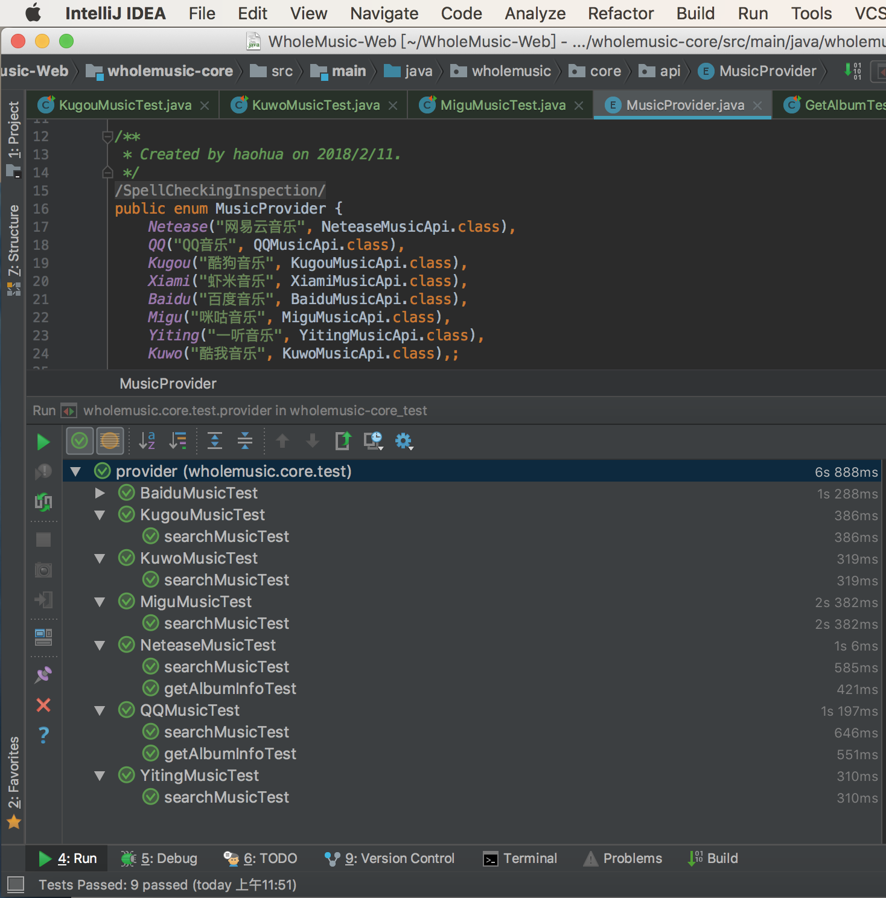

# WholeMusic
多家音乐平台接口的java实现（包括网易云音乐、QQ音乐、酷狗音乐、虾米音乐、百度音乐、咪咕音乐、一听音乐、酷我音乐、微博音乐）

Checklist

|            |   搜索&音乐链接    |    获取音乐详情    |    获取专辑信息    |      封面图      | 比特率 | 歌词 |
| :--------: | :---------------: | :----------------: | :----------------: | :----------------: | :--------: | :--------: |
| 网易云音乐 | :white_check_mark:  | :white_check_mark: | :white_check_mark: | :white_check_mark: | :white_check_mark: | :white_check_mark: |
|   QQ音乐  | :white_check_mark:  |      :clock1:      | :white_check_mark: | :white_check_mark: | :clock1: | :clock1: |
|  酷狗音乐  | :white_check_mark:  |      :clock1:      |      :clock1:      | :white_check_mark: | :white_check_mark: | :clock1: |
|  酷我音乐  | :white_check_mark:  |      :clock1:      |      :clock1:      |      :clock1:      | :clock1: | :clock1: |
|  虾米音乐  | :white_check_mark:  |      :clock1:      | :white_check_mark: | :white_check_mark: | ? | :white_check_mark: |
|  百度音乐  | :white_check_mark:  |      :clock1:      | :white_check_mark: |     ?              | ? | :clock1: |
|  一听音乐  | :white_check_mark:  | :white_check_mark: |      :clock1:      |       ?            | ? | :clock1: |
|  咪咕音乐  | :white_check_mark:  |      :clock1:      |      :clock1:      | :white_check_mark: | :clock1: | :clock1: |
| 微博音乐 | :white_check_mark:   |      :clock1:       |      :x:不支持      | :white_check_mark: |   ? | :clock1: |

TODO

- 增加各个平台专辑信息接口（现在只实现了网易云音乐、QQ音乐的专辑接口） -- By me
- 增加各个平台的歌词接口  -- By me
- 增加虾米音乐的detail信息（包括高品质链接） -- By Cyanhu
- 增加其他原创音乐平台的API（包括荔枝、蜻蜓、喜马拉雅、全民K歌、5sing原创、5sing翻唱等）

Further

- 音乐爬虫
- AI自动提取音乐信息

